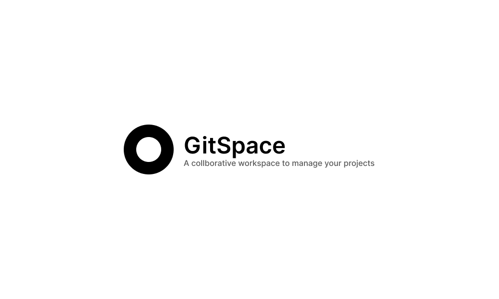

# Gitspace - Manage your projects collaboratively

## What is Gitspace?

Gitspace is a project management and issue/feature tracking tool which can be used to manage project boards and progress.

### Current deployment

- Current production deployment - [Production](https://gitspace-ui.vercel.app/)

## Project Status / Ideation

- As of now, the project frontend is under-development using components, widgets, and layouts and a lot more things.

## Future Plans

- Later we are going to use [socket.io](https://socket.io) for implementing chat functionality in between the team-mates.
- [Next.js](https://nextjs.org) will be used to create collaborative workspaces for users and teams

## Problem solved

A lot of kanban project management systems are there in the market but all the team-mates have to interact using other calling, messaging tools. Gitspace is a concept product which will be used to perform both the actions. People will be able to talk to each other, at the same time, they can manage their projects. Have a profile to share and friends to connect.
Overall, a workspace using git/github properties, Gitspace.

## Tech Stack

- ReactJS
- CSS/SCSS
- HTML/Javascript
- Hosted using [vercel](https://vercel.com/) cloud hosting service.

## For contributors

We are glad to see you here. We always love people who can contribute to projects, Feel free to raise issues/feature requests and send your PRs, get it reviewed, we'll merge it. Also, try following the best contribution guidelines, [See here](https://www.freecodecamp.org/news/how-to-contribute-to-open-source-projects-beginners-guide/) for reference.

**Thanks for having a look at this project, Feel free to raise issues and start contributing**
